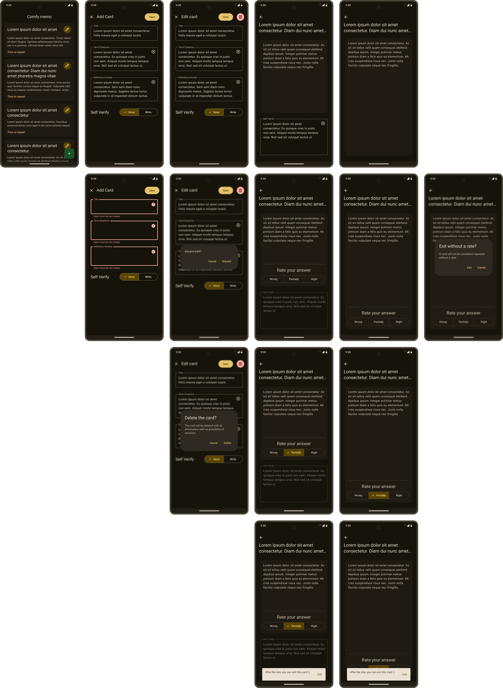

# Спецификация для ComfyMemo

## Содержание

1. [Введение](#1-введение)
2. [Функциональные Требования](#2-функциональные-требования)
3. [Дизайн](#3-дизайн)
4. [Алгоритм Интервального Повторения](#4-алгоритм-интервального-повторения)
5. [Базовые Сущности и Отношения](#5-базовые-сущности-и-отношения)
6. [Технические требования](#6-технические-требования)
7. [План Разработки](#7-план-разработки)

## 1. Введение

### 1.1. Цель Спецификации
Цель данной технической спецификации &mdash; подробно описать функциональные и технические требования для разработки мобильного приложения **ComfyMemo**. Этот документ служит основой для разработки, тестирования и дальнейшего расширения функционала приложения.

### 1.2. Обзор Приложения
**ComfyMemo** &mdash; мобильное приложение, предназначенное для эффективного запоминания информации с использованием метода интервального повторения, основанного на кривой забывания Эббингауза. Приложение помогает пользователям сохранять знания на длительный срок с минимальными усилиями.

## 2. Функциональные Требования

### 2.1. Таблица Функциональных Требований

| **ID** | **Название**                                                      | **Описание**                                                                                                                               |
| :----- | :---------------------------------------------------------------- | :----------------------------------------------------------------------------------------------------------------------------------------- |
| FNR-01 | Внесение информации для повторения                                | Возможность добавлять информацию, состоящую из вопроса и ответа, для последующего повторения.                                              |
| FNR-02 | Выбор способа проверки ответа на вопрос                           | Возможность выбирать различные способы проверки ответа на вопрос: устный ответ или письменный ввод.                                        |
| FNR-03 | Редактирование внесенной информации                               | Возможность удалять или обновлять информацию для повторения и связанные с ней параметры.                                                   |
| FNR-04 | Интервальное повторение                                           | Автоматическое планирование следующего повторения информации на основе алгоритма интервального повторения.                                 |
| FNR-05 | Организация информации для повторения                             | Размещение информации, требующей повторения, отдельно от остальной информации для улучшения наглядности.                                   |
| FNR-06 | Уведомления о необходимости начать повторение                     | Отправка уведомлений пользователю о необходимости начать повторение каждой внесенной информации в соответствии с установленным интервалом. |
| FNR-07 | Оценка повторения                                                 | Оценка запомненной информации (оценка ответа на вопрос) для корректировки интервалов повторений.                                           |
| FNR-08 | Локальное сохранение внесенной информации и интервалов повторений | Сохранение в памяти устройства данных об внесенной информации и об интервале повторений для каждой их этой информации                      |

### 2.2. Детализированные Функциональные Требования

> [!NOTE]
> Описанные ниже use-cases не являются актуальными и показали свою несостоятельность при создании прототипа (wireframe). Они не будут переработаны и оставлены для истории.

#### UC-01

| **Название**             | Внесение информации для повторения                                                                                                                                                                                                                                                                                                                                                                                                                                                                                                                                                                                                                                                                                                                                                                                                                                                                                                                                                               |
| :----------------------- | :----------------------------------------------------------------------------------------------------------------------------------------------------------------------------------------------------------------------------------------------------------------------------------------------------------------------------------------------------------------------------------------------------------------------------------------------------------------------------------------------------------------------------------------------------------------------------------------------------------------------------------------------------------------------------------------------------------------------------------------------------------------------------------------------------------------------------------------------------------------------------------------------------------------------------------------------------------------------------------------------- |
| **Цель**                 | Добавить информацию для повторения                                                                                                                                                                                                                                                                                                                                                                                                                                                                                                                                                                                                                                                                                                                                                                                                                                                                                                                                                               |
| **Актор**                | Пользователь                                                                                                                                                                                                                                                                                                                                                                                                                                                                                                                                                                                                                                                                                                                                                                                                                                                                                                                                                                                     |
| **Предусловия**          | Пользователь находится на главном экране                                                                                                                                                                                                                                                                                                                                                                                                                                                                                                                                                                                                                                                                                                                                                                                                                                                                                                                                                         |
| **Основной поток**       | 1. Пользователь нажимает Floating Action Button "+".<br>2. Система открывает Full Screen Dialog.<br>3. Пользователь заполняет поля "Вопрос" и "Ответ".<br>4. Пользователь выбирает способ проверки ответа на вопрос.<br>5. Пользователь нажимает Text Button "Save".<br>6. Система сохраняет информацию.<br>7. Система закрывает диалоговое окно.                                                                                                                                                                                                                                                                                                                                                                                                                                                                                                                                                                                                                                                |
| **Альтернативный поток** | **A1. Пользователь закрывает диалог**<br>&emsp;- Пользователь закрывает диалог с помощью Icon Button или Hardware back.<br>&emsp;- Система показывает Basic Dialog.<br>&emsp;- Пользователь выбирает опцию "Discard".<br>&emsp;- Система не сохраняет информацию.<br>&emsp;- Система закрывает оба диалоговых окна.<br>**A1.1. Пользователь отменяет закрытие диалога.**<br>&emsp;- Пользователь выбирает опцию "Cancel" в Basic Dialog.<br>&emsp;- Система закрывает только Basic Dialog.<br><br>**A2. Пользователь некорректно заполнил поля**<br>**A2.1. Пользователь некорректно заполнил поле "Вопрос"**<br>&emsp;- Поле "Вопрос" не содержит значащих символов.<br>&emsp;- Система визуально сигнализирует об ошибке и отображает сообщение ошибки под полем ввода.<br>**A2.2. Пользователь некорректно заполнил поле "Ответ"**<br>&emsp;- Поле "Ответ" не содержит значащих символов.<br>&emsp;- Система визуально сигнализирует об ошибке и отображает сообщение ошибки под полем ввода. |
| **Постусловия**          | 1. Система обновляет список внесенной информации.<br>2. Система сохраняет внесенную информацию на устройстве.<br>3. Система планирует повторение только что внесенной информации.                                                                                                                                                                                                                                                                                                                                                                                                                                                                                                                                                                                                                                                                                                                                                                                                                |
| **Связанные требования** | FNR-01<br>FNR-02<br>FNR-04<br>FNR-08                                                                                                                                                                                                                                                                                                                                                                                                                                                                                                                                                                                                                                                                                                                                                                                                                                                                                                                                                             |

#### UC-02

| **Название**             | Просмотр информации необходимой для повторения                                                                                                                                                                                                                                     |
| :----------------------- | :--------------------------------------------------------------------------------------------------------------------------------------------------------------------------------------------------------------------------------------------------------------------------------- |
| **Цель**                 | Увидеть информацию необходимую для повторения                                                                                                                                                                                                                                      |
| **Актор**                | Пользователь                                                                                                                                                                                                                                                                       |
| **Предусловия**          | Пользователь находится на главном экране                                                                                                                                                                                                                                           |
| **Основной поток**       | 1. Пользователь выбирает вкладку "Повторение" в Tab.<br>2. Система выдает список Card, необходимых для повторения согласно интервалу повторений.                                                                                                                                   |
| **Альтернативный поток** | **A1. Пользователь выбирает вкладку "Все карточки" в Tab**<br>&emsp;- Система выдает список всех Card, независимо от необходимости их повторения.<br><br>**A2. Информации не предоставлено**<br>&emsp;- Система вместо списка Card отображает сообщение о том, что информации нет. |
| **Постусловия**          | Система корректно отображает соответствующие Card для каждой вкладки в Tab                                                                                                                                                                                                         |
| **Связанные требования** | FNR-05<br>FNR-04                                                                                                                                                                                                                                                                   |

#### UC-03

| **Название**             | Повторение информации                                                                                                                                                                                                                                                                                                                                                                                                                                                                                                                                                                                                                                                                                                                                                                   |
| :----------------------- | :-------------------------------------------------------------------------------------------------------------------------------------------------------------------------------------------------------------------------------------------------------------------------------------------------------------------------------------------------------------------------------------------------------------------------------------------------------------------------------------------------------------------------------------------------------------------------------------------------------------------------------------------------------------------------------------------------------------------------------------------------------------------------------------- |
| **Цель**                 | Повторить информацию которая нуждается в этом                                                                                                                                                                                                                                                                                                                                                                                                                                                                                                                                                                                                                                                                                                                                           |
| **Актор**                | Пользователь                                                                                                                                                                                                                                                                                                                                                                                                                                                                                                                                                                                                                                                                                                                                                                            |
| **Предусловия**          | 1. Пользователь находится на главном экране во вкладке "Повторение".<br>2. Пользователь перешел по уведомлению о необходимости повторения.                                                                                                                                                                                                                                                                                                                                                                                                                                                                                                                                                                                                                                              |
| **Основной поток**       | 1. Пользователь нажимает на Card.<br>2. Система открывает экран повторения.<br>3. Система отображает увеличенную версию Card c вопросом.<br>4. Если способ проверки ответа был установлен как письменный ввод &mdash; пользователь вводит ответ в карточку.<br>5. Пользователь нажимает на карточку.<br>6. Система показывает другую сторону карточки с правильным ответом и, если способ проверки был установлен как письменный ввод &mdash; отображает введенный пользователем ответ.<br>7. Система отображает Slider для оценки повторения.<br> 8. Пользователь устанавливает на Slider необходимое значение.<br>9. Пользователь нажимает на Common Button "Finish" для завершения повторения.<br>10. В зависимости от оценки пользователя система корректирует интервал повторения. |
| **Альтернативный поток** | **A1. Пользователь перешел по уведомлению**<br>&emsp;- Система сразу открывает экран повторения для необходимой информации<br><br>**A2. Пользователь некорректно заполнил поле "Вопрос"**<br>&emsp;- Поле "Вопрос" не содержит значащих символов.<br>&emsp;- Система визуально сигнализирует об ошибке и отображает сообщение ошибки под полем ввода.<br><br>**A3. Пользователь выходит с экрана повторения**<br>&emsp;- Пользователь закрывает экран с помощью Icon Button или Hardware back.<br>&emsp;- Система не изменяет интервал повторения и не считает информацию повторенной.                                                                                                                                                                                                  |
| **Постусловия**          | 1. Система корректно изменила интервал повторений для данной информации.<br>2. Система убрала данную информацию из раздела для повторений.                                                                                                                                                                                                                                                                                                                                                                                                                                                                                                                                                                                                                                              |
| **Связанные требования** | FNR-04<br>FNR-05<br>FNR-06<br>FNR-07                                                                                                                                                                                                                                                                                                                                                                                                                                                                                                                                                                                                                                                                                                                                                    |

#### UC-04

| **Название**             | Уведомление о необходимости повторения                                                                     |
| :----------------------- | :--------------------------------------------------------------------------------------------------------- |
| **Цель**                 | Отправить пользователю уведомление о необходимости повторения конкретной информации                        |
| **Актор**                | Система                                                                                                    |
| **Предусловия**          | Некоторая информация стала нуждаться в повторении по истечении установленного интервала повторений для нее |
| **Основной поток**       | Система отправляет уведомление пользователю.                                                               |
| **Альтернативный поток** | &mdash;                                                                                                    |
| **Постусловия**          | Пользователь получил уведомление                                                                           |
| **Связанные требования** | FNR-04<br>FNR-06                                                                                           |

#### UC-05

| **Название**             | Редактирование внесенной информации                                                                                                                                                                                                                                                                                                                                                                                                                                                                                                                                                                                                                                                                                                                                                                                                                                                                                                                                                                                                                                                                                                                                               |
| :----------------------- | :-------------------------------------------------------------------------------------------------------------------------------------------------------------------------------------------------------------------------------------------------------------------------------------------------------------------------------------------------------------------------------------------------------------------------------------------------------------------------------------------------------------------------------------------------------------------------------------------------------------------------------------------------------------------------------------------------------------------------------------------------------------------------------------------------------------------------------------------------------------------------------------------------------------------------------------------------------------------------------------------------------------------------------------------------------------------------------------------------------------------------------------------------------------------------------- |
| **Цель**                 | Редактировать (обновить/удалить) внесенную информацию и связанные с ней параметры (способ ответа)                                                                                                                                                                                                                                                                                                                                                                                                                                                                                                                                                                                                                                                                                                                                                                                                                                                                                                                                                                                                                                                                                 |
| **Актор**                | Пользователь                                                                                                                                                                                                                                                                                                                                                                                                                                                                                                                                                                                                                                                                                                                                                                                                                                                                                                                                                                                                                                                                                                                                                                      |
| **Предусловия**          | Пользователь находится на главном экране во вкладке "Все карточки"                                                                                                                                                                                                                                                                                                                                                                                                                                                                                                                                                                                                                                                                                                                                                                                                                                                                                                                                                                                                                                                                                                                |
| **Основной поток**       | 1. Пользователь нажимает на Card.<br>2. Система открывает Full Screen Dialog.<br>3. Пользователь вносит изменения в необходимые поля.<br>4. Пользователь нажимает на Common Button "Save".<br>5. Система сохраняет изменения.                                                                                                                                                                                                                                                                                                                                                                                                                                                                                                                                                                                                                                                                                                                                                                                                                                                                                                                                                     |
| **Альтернативный поток** | **A1. Пользователь отменяет редактирование**<br>&emsp;- Пользователь закрывает диалоговое окно с помощью Text Button или Hardware back.<br>&emsp;- Система закрывает диалоговое окно без сохранения изменений.<br><br>**A2. Пользователь удаляет карточку**<br>&emsp;- Пользователь нажимает на Common Buttons "Delete".<br>&emsp;- Система запрашивает подтверждение удаления при помощи Basic Dialog.<br>&emsp;- Пользователь подтверждает удаление.<br>&emsp;- Система удаляет карточку, переходит на главный экран и отображает SnackBar с сообщением об успешном удалении.<br>**А2.1. Пользователь отменяет удаление.**<br>&emsp;- Пользователь отменяет удаление в Basic Dialog.<br>&emsp;- Система закрывает Basic Dialog.<br><br>**A3. Пользователь некорректно заполнил поле "Вопрос"**<br>&emsp;- Поле "Вопрос" не содержит значащих символов.<br>&emsp;- Система визуально сигнализирует об ошибке и отображает сообщение ошибки под полем ввода.<br>**A4. Пользователь некорректно заполнил поле "Ответ"**<br>&emsp;- Поле "Ответ" не содержит значащих символов.<br>&emsp;- Система визуально сигнализирует об ошибке и отображает сообщение ошибки под полем ввода. |
| **Постусловия**          | 1. Данные информации изменены и система отображает обновленные данные<br>2. Система сохранила в памяти устройства обновленные данные.                                                                                                                                                                                                                                                                                                                                                                                                                                                                                                                                                                                                                                                                                                                                                                                                                                                                                                                                                                                                                                             |
| **Связанные требования** | FNR-03<br>FNR-08                                                                                                                                                                                                                                                                                                                                                                                                                                                                                                                                                                                                                                                                                                                                                                                                                                                                                                                                                                                                                                                                                                                                                                  |

## 3. Дизайн

Дизайн приложения разработан в соответствии с [Material Design 3](https://m3.material.io/), используя цвета, типографику и другие элементы из этого стиля. Дизайн стремится максимально следовать описанным гайдлайнам.

Прототип (Wireframe) и основной дизайн приложения доступны в Figma на разных страницах одного файла: [Wireframe и Design в Figma](https://www.figma.com/design/CVwH19B1uxDVptcWmo3dMN/comfy-memo?node-id=38-65&t=uoG4BnbBraSNurUB-1)



## 4. Алгоритм Интервального Повторения

Алгоритм интервального повторения, используемый в **ComfyMemo** &mdash; [FSRS (Free Spaced Repetition Scheduler)](https://github.com/open-spaced-repetition/fsrs4anki/wiki/ABC-of-FSRS).
Он основан на принципах кривой забывания Эббингауза и адаптируется под индивидуальные результаты пользователя. Цель алгоритма &mdash; оптимизировать интервалы между повторениями для максимальной эффективности запоминания информации.

## 5. Базовые Сущности и Отношения

Архитектура созданных сущностей позволяет интегрировать другие алгоритмы интервального повторения, такие как [SM-2](https://github.com/open-spaced-repetition/fsrs4anki/wiki/Spaced-Repetition-Algorithm:-A-Three%E2%80%90Day-Journey-from-Novice-to-Expert#sm-2), без изменения базовой структуры. Это достигается за счёт расширения сущностей ReviewLog и SchedulerEntry для поддержки специфики каждого алгоритма.

### 5.1 Сущности

#### **Flashcard (Карточка)**

| **Атрибут** | **Тип данных** | **Описание**                                        |
| :---------- | :------------- | :-------------------------------------------------- |
| id          | UUID           | Уникальный идентификатор карточки                   |
| title       | String         | Название карточки                                   |
| term        | String         | Термин/Вопрос                                       |
| definition  | String         | Определение/Ответ                                   |
| self_verify | Enum           | Тип проверки ответа (самопроверка) (None, Written). |

#### **ReviewLog (Журнал Повторений)**

| **Атрибут** | **Тип данных** | **Описание**                                      |
| :---------- | :------------- | :------------------------------------------------ |
| id          | UUID           | Уникальный идентификатор записи                   |
| card_id     | UUID           | Идентификатор связанной карточки                  |
| review      | Datetime       | Дата и время проведения повторения                |
| rating      | Enum           | Оценка пользователя (Forgot, Hard, Good, Perfect) |

#### **FSRSReviewLog (Журнал Повторений FSRS)**

| **Атрибут**   | **Тип данных** | **Описание**                                                            |
| :------------ | :------------- | :---------------------------------------------------------------------- |
| id            | UUID           | Уникальный идентификатор записи                                         |
| review_log_id | UUID           | Идентификатор связанной записи в ReviewLog                              |
| state         | Enum           | Состояние карточки после повторения (New, Learning, Review, Relearning) |

#### **SchedulerEntry (Запись Планировщика)**

| **Атрибут**    | **Тип данных** | **Описание**                                    |
| :------------- | :------------- | :---------------------------------------------- |
| id             | UUID           | Уникальный идентификатор записи планировщика    |
| card_id        | UUID           | Идентификатор связанной карточки                |
| due            | Datetime       | Дата и время следующего повторения              |
| scheduled_days | Integer        | Количество дней до следующего повторения        |
| elapsed_days   | Integer        | Количество дней с момента последнего повторения |
| reps           | Integer        | Количество повторений                           |
| lapses         | Integer        | Количество пропусков                            |
| last_review    | Datetime       | Дата и время последнего повторения              |

#### **FSRSSchedulerEntry (Запись Планировщика FSRS)**

| **Атрибут**  | **Тип данных** | **Описание**                                                   |
| :----------- | :------------- | :------------------------------------------------------------- |
| id           | UUID           | Уникальный идентификатор записи                                |
| scheduler_id | UUID           | Идентификатор связанной записи планировщика                    |
| stability    | Float          | Коэффициент стабильности                                       |
| difficulty   | Float          | Коэффициент сложности                                          |
| state        | Enum           | Текущее состояние карточки (New, Learning, Review, Relearning) |

### 5.2 Отношения/Связи

```
Flashcard (1) ─── (M) ReviewLog (1) ─── (1) FSRSReviewLog
      |
      ╰─── (1) SchedulerEntry (1) ─── (1) FSRSSchedulerEntry
```

## 6. Технические Требования

### 6.1. Основной Технологический Стэк

**[Dart и Flutter:](https://flutter.dev/)** Основные технологии для разработки бизнес-логики и пользовательских интерфейсов.

### 6.2. Дополнительные Технологии

- **Хранение данных:** В первых версиях приложения будет использоваться **[JSON](https://www.json.org/json-en.html)** и файловое хранение данных, но по мере развития будут интегрированы базы данных.
- **Внешние Библиотеки:** Использование специализированных библиотек ограничено необходимостью работы с аппаратной частью ОС (например, камера, файловое хранилище) и специализированными задачами (например, тестирование).

### 6.3. Подход к Архитектуре

- **Минимальное Использование Внешних Решений:** Проект стремится максимально использовать встроенные средства SDK, избегая внешних решений для лучшего понимания встроенных возможностей выбранного стэка и контроля над функционалом.
- **Модульность:** Архитектура будет разработана таким образом, чтобы компоненты системы можно было легко заменять или обновлять без нарушения общей структуры. Например переход от хранения данных в JSON к использованию базы данных должен осуществляться бесшовно, благодаря принципу модульности и полиморфному поведению компонентов.

## 7. План Разработки

**[GitHub Projects:](https://github.com/users/cocahonka/projects/4)** Используется для управления задачами и отслеживания прогресса разработки.

Все задачи оформляются как issue в репозитории и для каждой задачи будет создаваться отдельная ветка (branch), которая после завершения будет сливаться в `main`.

